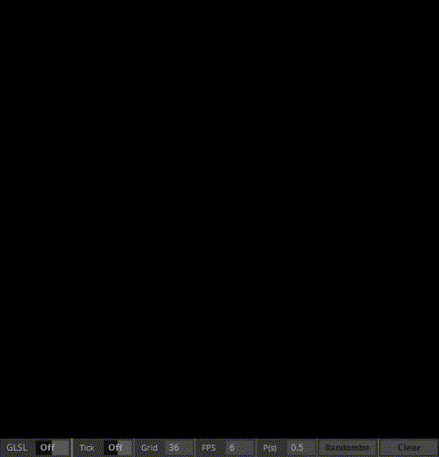
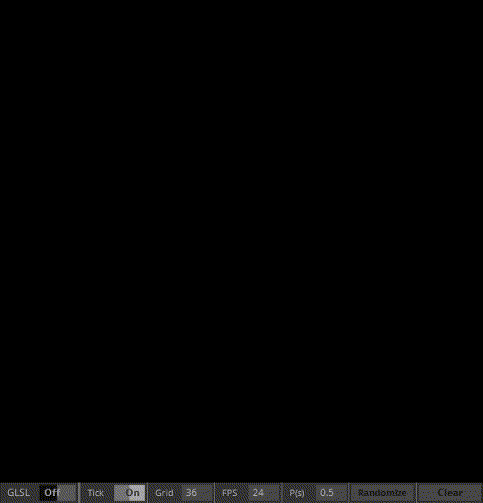

# Conway's Game of Life in TouchDesigner (Both GLSL & DAT's)

Currently there are 2 supported modes
- CPU (GLSL toggled off)
- GLSL 

Each mode has it's own advantages.

## CPU Mode: 
CPU mode was implemented using DATs, thus performance is much lower. On an i7 6700, I was able to get around 45 FPS with a gridsize of 60.
In CPU mode you can draw on the canvas to interact with it.

You can also change the probability distribution of a cell spawning when you press randomize.

## GLSL Mode:
I recently started learning GLSL and thought that implementing this in GLSL would be a nice way to start getting familiar with it.
I don't know if how I implemented is the best way, but i was able to get solid 60 FPS with a gridsize of 2048 on a 1070 Ti.

![](gifs/glsl_random.gif

### Notes:
A TOX version is available in the TOX folder.

### Bugs:
- Generation update is implemented through a Timer CHOP and when the tick rate exceeds the FPS TouchDesigner is running at updates stop occuring. 
- In CPU mode, when the grid size is increased and Tick is disabled the newly created area of the canvas can not be interacted with.
